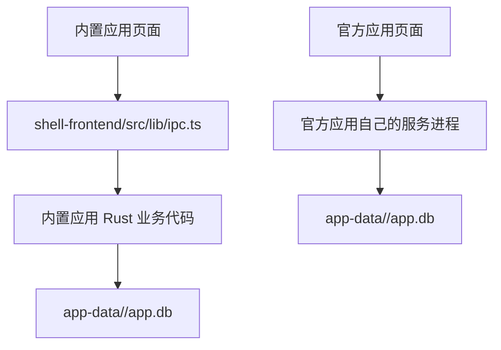

# aIdea 平台规范

本文档定义 aIdea 壳、内置应用和官方应用的职责边界。它是平台架构和应用生命周期的权威来源。

## 术语与范围

| 术语 | 定义 |
| --- | --- |
| aIdea 壳 | 本地应用平台，负责应用目录、生命周期、运行状态、日志、平台组件和自身更新。 |
| 内置应用 | 代码位于 aIdea 仓库，随 aIdea 构建、发布和更新的应用。 |
| 官方应用 | 独立 Git 仓库中的自研应用，由官方市场预设收录。 |
| 官方应用市场 | 独立 Git 仓库中的官方收录目录；开搞内置 `market-source.yaml` 作为其稳定入口。完整应用定义在各应用仓库的 `aidea.yaml`。 |
| 平台组件 | aIdea 提供的数据目录、日志目录和进程管理等能力。 |

当前只支持内置应用和官方应用。不提供第三方市场、自定义仓库安装、自动发现或多作者权限系统；新增这些能力必须先单独设计。

当前仓库的 `apps/builtin/mail-manager.yaml` 是内置应用，所以现有邮件管理使用壳内 Tauri IPC。将邮件管理独立成官方应用时，应建立独立应用仓库和 `aidea.yaml`；新应用不能继续依赖当前邮件模块的内部 IPC 或 Rust 命令名。

## 职责边界

| aIdea 管理 | 应用管理 |
| --- | --- |
| 安装、更新、卸载、启动、停止、健康检查 | 业务代码、业务 UI、业务网络请求和错误处理 |
| WebView、日志、运行状态、官方市场展示 | 业务数据、SQLite、配置、迁移和兼容性 |
| aIdea 自身更新 | 业务数据保留和清理策略 |

更新只能替换平台管理的源码、依赖和运行记录，不得覆盖业务数据。默认卸载只删除这些平台管理的内容，保留 `app-data/<app-id>/` 和业务日志；删除业务数据必须让用户单独确认。

## 通信边界

- Tauri IPC 仅供 aIdea 壳和内置应用使用。内置应用前端统一通过 `shell-frontend/src/lib/ipc.ts` 调用，不得在业务组件直接调用 `invoke`。
- 官方应用不得依赖 `@tauri-apps/api`、`window.__TAURI__`、Rust 命令名或壳前端 IPC 封装。这些都是壳的内部实现。
- 官方应用只能使用 aIdea 注入的应用数据和日志目录；应用业务代码直接读写自己的数据库。
- 内置应用的页面不能直接访问本地文件，所以通过 `ipc.ts` 调用自己的 Rust 业务模块；这不改变数据库归属。
- 两类应用都不得读取 aIdea 壳配置或其他应用的数据库。

## 生命周期与异常隔离

官方应用的运行顺序为：市场展示 -> 安装 -> 校验定义 -> 获取固定版本源码 -> 安装依赖 -> 启动 -> 本地健康检查 -> WebView 展示 -> 更新或卸载。

安装、更新、启动或健康检查失败时，aIdea 保留错误日志和已知可运行版本，不自动删除用户数据。单个应用异常只影响该应用，壳和其他应用继续运行；异常应用仍显示在顶部菜单和应用管理中，供用户查看日志、刷新、更新或卸载。

用户手动刷新市场时，开搞先读取内置市场地址并拉取官方市场仓库的 `official/*.yaml`，再读取每个已启用应用仓库默认分支的 `aidea.yaml`。市场目录和应用定义都成功后，才整体替换 `runtime/market-cache/`；任一步失败都保留最近一次成功缓存。新增应用或调整仓库地址只需更新市场仓库，用户刷新市场即可获取；只有市场入口地址或协议变化时才需要发布新版开搞。

## 应用设置与覆盖

应用管理列表只负责显示应用、显示开关和进入设置详情。设置详情在 aIdea 的设置弹窗内打开，不跳转主内容区。

- 用户改动 `name`、`icon`、`url`、`start` 时，aIdea 写入 `shell.config.json` 的 `overrides`，不回写原始 yaml。`list_apps` 已合并这些覆盖值，前端不得二次合并。
- `visible` 和 `startup_mode` 是 aIdea 管理的通用设置，保存于 `shell.config.json`；它们只决定应用是否显示和是否随 aIdea 启动。
- 应用业务设置由应用自己负责。内置应用在壳内显式注册基础设置组件，官方应用提供固定的本地 `/settings` 页面；aIdea 只负责打开入口，不解析应用字段或保存应用表单。
- 官方应用的主页面和 `/settings` 页面都会收到 aIdea 追加的 `aidea_theme=light|dark` 参数；应用据此跟随 aIdea 的主题选择，独立运行时再回退到系统主题。
- 只有声明独立 `process` 的应用可显示“随 aIdea 启动”。
- 每个应用都有 aIdea 提供的通用设置详情页；内置应用可额外注册业务设置组件，官方应用固定提供 `/settings` 页面。`settings.enabled` 是当前 manifest 的兼容字段，不控制设置入口；Rust 代码只在它为 `true` 时接受 `reset_command`。
- `reset_command` 是可选的配置重置能力。用户确认后，aIdea 停止运行中的应用、执行重置并按原状态恢复；重置只能修改配置，不能删除整个业务数据目录或业务数据库。

## 两种应用如何保存数据

两类应用都直接拥有并管理自己的数据库。内置应用由于运行在 WebView 中，页面通过自己的 Tauri IPC 到达应用 Rust 业务代码；官方应用由自己的服务进程直接访问 `AIDEA_APP_DATA_DIR/app.db`。

## 独立运行

官方应用必须能脱离 aIdea 运行核心业务，便于开发、测试和故障排查；有 aIdea 环境变量时使用平台目录，独立运行时使用自身默认目录。它不需要复制桌面壳、市场、更新器或进程管理。
