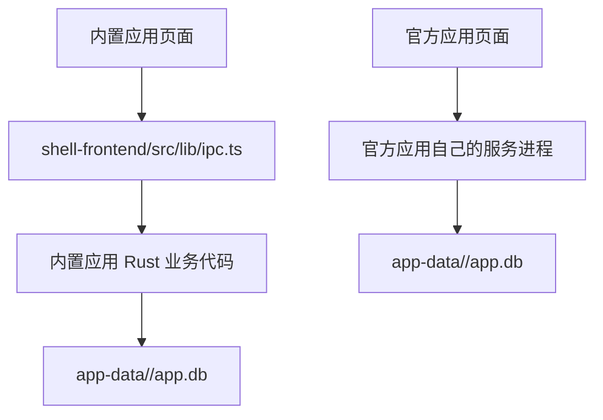

# aIdea 平台规范

本文档定义 aIdea 壳、内置应用和官方应用的职责边界。它是平台架构和应用生命周期的权威来源。

## 术语与范围

| 术语 | 定义 |
| --- | --- |
| aIdea 壳 | 本地应用平台，负责应用目录、生命周期、运行状态、日志、平台组件和自身更新。 |
| 内置应用 | 代码位于 aIdea 仓库，随 aIdea 构建、发布和更新的应用。 |
| 官方应用 | 独立 Git 仓库中的自研应用，由官方市场预设收录。 |
| 官方应用市场 | 独立 Git 仓库中的官方收录目录；开搞内置 `market-source.yaml` 作为其稳定入口。完整应用定义在各应用仓库的 `aidea.yaml`。 |
| 平台组件 | aIdea 提供的数据目录、日志目录和进程管理等能力。 |

当前只支持内置应用和官方应用。不提供第三方市场、自定义仓库安装、自动发现或多作者权限系统；新增这些能力必须先单独设计。

官方应用只面向 macOS Apple Silicon（arm64）的自包含 binary 包。Intel Mac 和其他操作系统不在支持范围；不实现多架构产物选择或回退。

邮件管理不再是 aIdea 的内置应用。新的邮件管理固定为官方应用 `mail-center`，必须使用独立应用仓库和已发布的 arm64 自包含包；按官方应用规范创建正式 `aidea.yaml`。新应用不能依赖旧邮件的内部 IPC、Rust 命令名、前端组件或旧数据库。

## 职责边界

| aIdea 管理 | 应用管理 |
| --- | --- |
| 安装、更新、卸载、启动、停止、健康检查 | 业务代码、业务 UI、业务网络请求和错误处理 |
| WebView、日志、运行状态、官方市场展示 | 业务数据、SQLite、配置、迁移和兼容性 |
| aIdea 自身更新 | 业务数据保留和清理策略 |

更新只能替换平台管理的解压应用包、依赖和运行记录，不得覆盖业务数据。默认卸载只删除这些平台管理的内容，保留 `app-data/<app-id>/` 和业务日志；删除业务数据必须让用户单独确认。历史 `mail-manager` 数据不迁移到 `mail-center`，aIdea 也不读取、不写入、不自动处理这些旧路径。

## 通信边界

- Tauri IPC 仅供 aIdea 壳和内置应用使用。内置应用前端统一通过 `shell-frontend/src/lib/ipc.ts` 调用，不得在业务组件直接调用 `invoke`。
- 官方应用不得依赖 `@tauri-apps/api`、`window.__TAURI__`、Rust 命令名或壳前端 IPC 封装。这些都是壳的内部实现。
- 官方应用与 aIdea 壳之间的运行时通信统一使用 [App Bridge](aidea-app-bridge.md)；首期只实现 `ready`、`theme`、`notify` 和 `navigate`。搜索不属于 App Bridge，按 [应用内搜索规范](aidea-search.md) 由应用自己实现。
- 官方应用调用 aIdea AI 能力时使用 [AI 网关契约](aidea-ai-gateway.md) 的本机 `/api` 接口；不直接访问上游 AI 服务、API Key 或 Codex app-server。
- 官方应用只能使用 aIdea 注入的应用数据和日志目录；应用业务代码直接读写自己的数据库。
- 内置应用的页面不能直接访问本地文件，所以通过 `ipc.ts` 调用自己的 Rust 业务模块；这不改变数据库归属。
- 两类应用都不得读取 aIdea 壳配置或其他应用的数据库。

## 生命周期与异常隔离

官方应用的运行顺序为：市场展示 -> 校验定义 -> 下载预编译包 -> SHA-256 校验 -> 安装/解压 -> staging 本地健康检查 -> 替换 `source/` -> 启动 -> WebView 展示 -> 更新或卸载。正式市场应用只接受单个 arm64 自包含包；源码调试在应用仓库直接运行，不经过安装器。

binary 包只接受 Gitee、GitHub 或 GitLab（包括自建实例）同仓库 Release 的 HTTP 或 HTTPS `.tar.gz` 附件。安装器拒绝绝对路径、`..`、符号链接、硬链接、多顶层目录和顶层直接文件；解压内容写入既有 `source/`。更新运行中的应用时，新版本若无法启动，aIdea 会恢复旧 `source/`、安装记录和原运行状态。

安装、更新、启动或健康检查失败时，aIdea 保留错误日志和已知可运行版本，不自动删除用户数据。单个应用异常只影响该应用，壳和其他应用继续运行；异常应用仍显示在顶部菜单和应用管理中，供用户查看日志、刷新、更新、卸载或重试启动。启动失败不会锁死生命周期操作：应用已停止且不处于启动或停止过渡状态时，用户可以重试启动；异常原因保留到下一次启动成功，或被下一次失败的原因覆盖。

aIdea 异常退出后，只接管存在有效运行记录、PID 存活、命令参数、工作目录、版本、健康检查地址和独立进程组均与当前安装定义一致，且 `/health` 仍成功的进程；不满足任一条件的运行记录会被删除。用户在开发目录手动启动的服务不受接管，也不会被停止操作管理。

用户手动刷新市场时，开搞先通过平台 API/Raw 地址读取官方市场仓库的 `official/*.yaml`，再读取每个已启用应用仓库默认分支的 `aidea.yaml`，不执行 Git clone 或 checkout。自建 GitLab 使用其仓库的 HTTP 或 HTTPS 地址。市场目录和应用定义都成功后，才整体替换 `runtime/market-cache/`；任一步失败都保留最近一次成功缓存。新增应用或调整仓库地址只需更新市场仓库，用户刷新市场即可获取；只有市场入口地址或协议变化时才需要发布新版开搞。

官方应用的 Release 历史由壳后端按仓库地址查询 Gitee、GitHub 或 GitLab（包括自建实例）的 API，前端不直接携带凭据访问网络。Gitee 和 GitHub 使用各自 API；GitLab 可使用 HTTP 或 HTTPS 仓库地址。匿名 API 不可访问时只提示错误，不影响应用安装和更新。

## 应用设置

应用管理列表只负责显示应用和壳层偏好。内置应用可进入 aIdea 的设置详情；官方应用不提供壳内设置页，业务设置从自己的主页面进入。

- `visible` 和 `startup_mode` 是 aIdea 管理的通用设置，保存于 `shell.config.json`；它们只决定应用是否显示和是否随 aIdea 启动。
- 官方应用卡片提供“显示在主页”开关；其更多菜单管理启动、停止、重启、更新、日志、卸载和“随开搞启动”。业务字段、校验和保存都由官方应用自己负责。
- 官方应用主页面会收到 aIdea 追加的 `aidea_theme=light|dark` 参数；应用据此跟随 aIdea 的主题选择，独立运行时再回退到系统主题。主页面 `ready` 后，运行期主题通过 App Bridge 同步。
- 只有声明独立 `process` 的官方应用可显示“随开搞启动”。
- 内置应用可显式注册壳内业务设置组件；`settings.reset_command` 只属于内置应用。用户确认后执行已注册的内置重置处理器；处理器不能删除整个业务数据目录或业务数据库。

## 两种应用如何保存数据

两类应用都直接拥有并管理自己的数据库。内置应用由于运行在 WebView 中，页面通过自己的 Tauri IPC 到达应用 Rust 业务代码；官方应用由自己的服务进程直接访问 `AIDEA_APP_DATA_DIR/app.db`。

## 独立运行

官方应用必须提供快速的 `GET /health`。aIdea 对单次请求最多等待 1 秒，并在启动后的 15 秒内每 100ms
重试；任意 HTTP 2xx 响应即代表应用服务可接收请求，不检查响应体或外部依赖。账户、同步和其他业务设置由应用自己的主页面导航组织，aIdea 不解析业务字段。

官方应用推荐能脱离 aIdea 运行核心业务（可选，非硬性约束），便于开发、测试和故障排查；有 aIdea 环境变量时使用平台目录，独立运行时使用自身默认目录。它不需要复制桌面壳、市场、更新器或进程管理。
